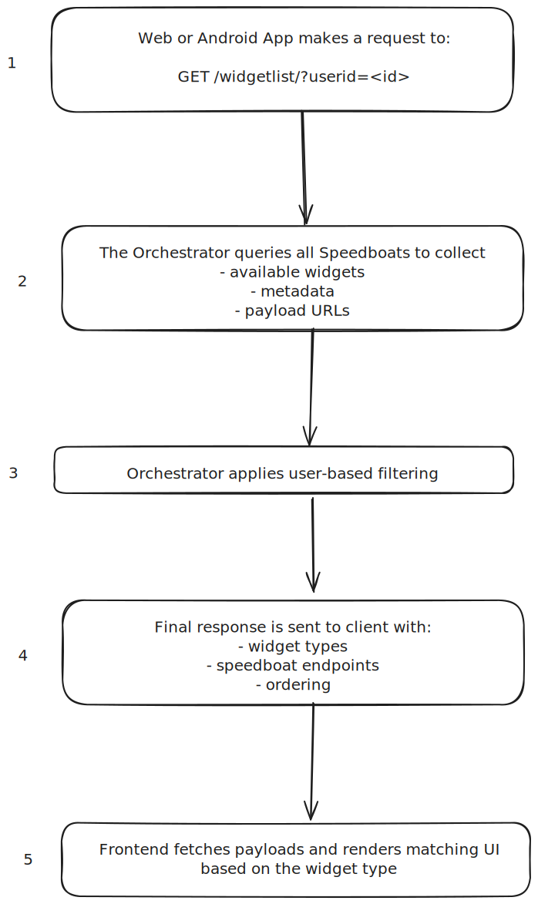

# DEVELOPER_GUIDELINE.md

## 1 How Product Teams Build and Integrate Home Widgets

This document explains how decentralized CHECK24 product teams can develop, register, and deliver their own Home Widgets across Web and Android.

**The core idea**:
- Each product domain (Travel, Home, Shopping, etc.) provides its own Speedboat microservice.
- A central Orchestrator aggregates these Speedboats and returns the final list of widgets to be rendered on the Home Screen.
- Web and Mobile Apps behave as simple Renderers. They render whatever widget configuration the Orchestrator returns.
- Updates to content and styling do not require app releases.



## 2 Creating a New Speedboat
Each speedboat is a standalone FastAPI microservice.
Copy this structure:

```bash
/product_services
    /new-service
    └── main.py
    └── Dockerfile
    └── requirements.txt
```
You will have to adjust the Dockerfile according to the new service.
Specify endpoints and behavior within the main and add it to the `docker-compose.yml`. **You will need to specify a new port**:

```bash
contract:
    build:
      context: .
      dockerfile: ./product_services/contract/Dockerfile
    ports:
      - "8004:8004"

new-service:
    build:
        context: .
        dockerfile: ./product_services/new-service/Dockerfile
    ports:
      - "8005:8005"
```

## 3 Exposing Your Widgets

A speedboat must an endpoint `/<widget_url>` with the following rules:
- Payload must match the expectations of the widget type
- Payload must be JSON
- No HTML allowed
- Images must be served via URLs


Example:
```json
{
  "header": "Beliebte Reiseziele",
  "items": [
    {
      "title": "London",
      "subtitle": "7.121 Unterkünfte",
      "image": "https://example.com/london.jpg"
    }
  ]
}
```

## 4 Supported Widget Types

| Widget ID             | Type       | Provided By        | Status            |
| --------------------- | ---------- | ------------------ | ----------------- |
| mobile_minimal        | minimal    | Contract           | ✔ live            |
| credit_minimal        | minimal    | Contract           | ✔ live            |
| home_widget           | dual | Home               | ✔ live            |
| sportTravel_grid      | basic_grid       | Travel             | ✔ live            |
| normalTravel_featured | featured_grid   | Travel             | ✔ live            |
| cityTravel_featured   | featured_grid   | Travel             | ✔ live            |
| blackfriday_banner    | deal     | Shopping           | ✔ live            |
| christmas_banner      | deal     | Shopping           | ✔ live            |
| shopping_carousel     | carousel   | Shopping | ✔ live            |
| travel_carousel       | alternative_carousel   | Frontend             | ⚠ only web |
| car_widget            | car_widget          | Frontend       | ⚠ only web     |

If you need a new widget type: 
- inform frontend teams
- implement renderer for Web + Mobile
- create schema
- Core activates support in the orchestrator

After this, the widget becomes dynamically usable without app updates.

# 5 Best Practices for Product Teams
