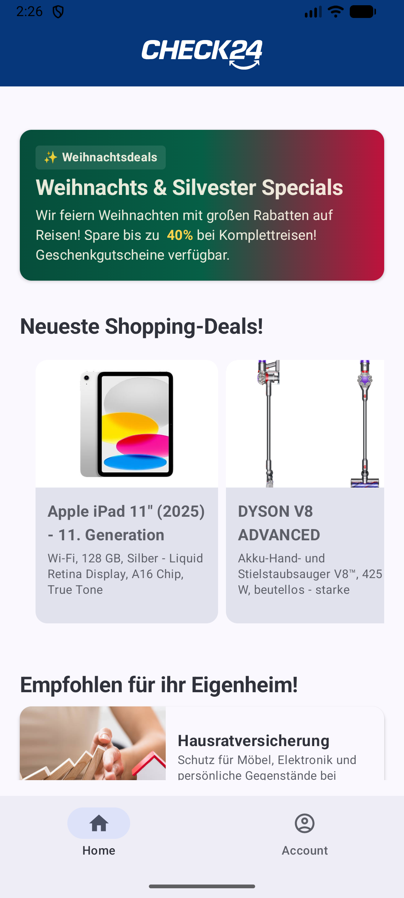
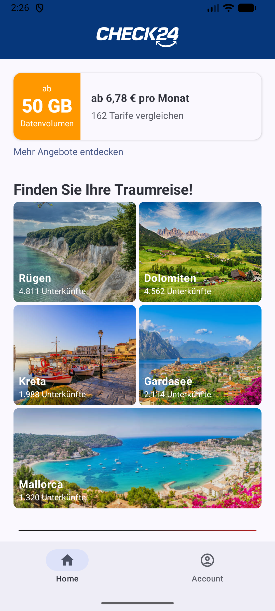
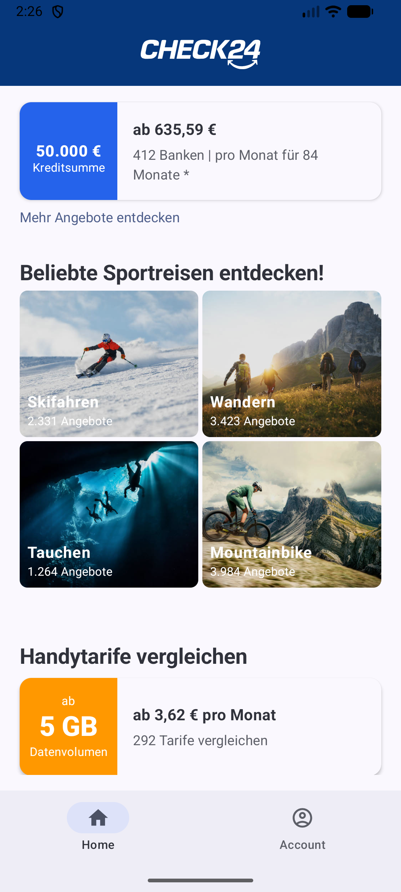
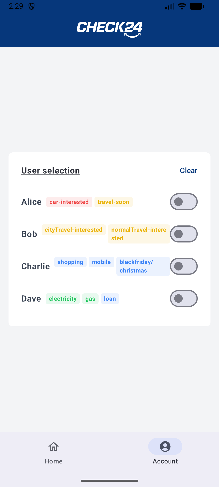

# GenDev 8 - Home Widgets System (Christoph Gerards)
[](https://github.com/check24-scholarships/check24-technical-concept-challenge)

## Dokumente
- [CONCEPT.md](./CONCEPT.md) (englisch)
- [DEVELOPER_GUIDELINE.md](./DEVELOPER_GUIDELINE.md) (englisch)
- [Proof of Concept – Live Deployment](https://www.check24-challenge-gerards.vercel.app/)
- [Application Video](https://your-video-link)

## Einleitung
Vielen Dank, dass Sie meine Umsetzung für die **Check24 GenDev Scholarship** Challenge in Betracht ziehen.
Über die letzten Wochen hat es mir sehr viel Spaß gemacht, an dieser Challenge zu arbeiten und ich habe viel dazu gelernt. Für mich war vor allem die Entwicklung einer nativen App eine tolle, neue Erfahrung, die ich hiermit umsetzen konnte.

In diesem Projekt stelle ich eine Next.js/React-basierte Webseite zur Verfügung, welche die Startpage von Check24 replizieren soll. Hierbei habe ich einige Widgets erstellt, die einzeln von verschiedenen Speedboats geladen werden. Hierdurch liegt die Auslastung nicht ausschließlich bei der Startpage, sondern wird von mehreren Speedboats abgehandelt. 

Zusätzlich dazu habe ich eine native Android App *(Kotlin Compose)* entwickelt, welche die Startpage der Check24-App darstellen soll. Hierbei ist das gleiche Verhalten wie bereits in der Webseite für die App "übersetzt" implementiert worden. Dazu wurden für die App-Version eigens Widgets designed und implementiert, die jedoch auf die gleichen Daten der Speedboats zugreifen.

In dieser README wird das Projekt vorgestellt und Installationshinweise bereitgestellt.

## Video 

## Deployment
Die Web-Version habe ich vollständig deployed, um öffentlichen Zugriff zu ermöglichen.
Hierbei ist das Frontend über Vercel gehostet, da das Next.js Framework sehr gut unterstützt wird (gleiches Entwicklungsteam).

Das Backend habe ich über AWS gehostet, da ich damit bereits Erfahrung habe und es zusätzlich gängige Praxis ist.

Die Webseite ist über folgenden Link erreichbar:
<h3 align="center">
  <a href="https://www.check24-challenge-gerards.vercel.app/" target="_blank">check24-challenge-gerards.vercel.app</a>
</h3>


## Screenshots des Projekts

<div style="display: flex; gap: 10px; flex-wrap: wrap;">
  
  
  
  
</div>

## Installationsanleitung des PoC


### Web-Version
Die Web-Version wird mithilfe von `npm` bzw. `pnpm` gestartet. Diese Version basiert auf Next.js/React.
```bash
$ cd check24-web
/check24-web $ pnpm install
/check24-web $ pnpm dev
```
Anschließend ist die Webseite über `localhost:3000` im Browser erreichbar.

### Backend (Orchestrator + Speedboats)
Die einzelnen Speedboats habe ich in einer `docker-compose.yaml` spezifiziert.
Diese kann man mithilfe von Docker starten:

```bash
$ docker compose up --build
```

Anschließend wurden fünf Services bzw. Speedboats gestartet:
- Port **8000**: orchestrator *[Hauptdienst zum Laden der Widgets, z.B. auch Anordnung]*
- Port **8001**: home *[Dienst für Eigenheim-Widgets]*
- Port **8002**: travel *[Dienst für Reise-Widgets]*
- Port **8003**: shopping *[Dienst für Shopping-Widgets]*
- Port **8004**: contract *[Dienst für Vertrags-Widgets]*

### Mobile (Android)
Das Android-Projekt liegt im Ordner `check24_mobile`.

Import:
1. Android Studio öffnen 
2. ***Open*** -> `check24_mobile`
3. Projekt laden lassen (Gradle sync)
4. Emulator starten -> ***Run***


## Zusammenfassung der Architektur


## Features


## Technologien
- Next.js React für das Frontend
- FastAPI für den Orchestrator und die Speedboats
- Kotlin Compose für die Native Android App


## Kontakt
Vielen Dank, dass sie meine Umsetzung dieser Challenge in Erwägung ziehen. Meine Intention war, die Challenge gründlich zu lösen, um dabei viel zu lernen.
Ich hoffe, dass ich meine Eignung für dieses Stipendium ausreichend demonstrieren konnte.

Für Fragen und Ähnliches stehe ich natürlich zur Verfügung: `christoph.gerards@gmail.com`